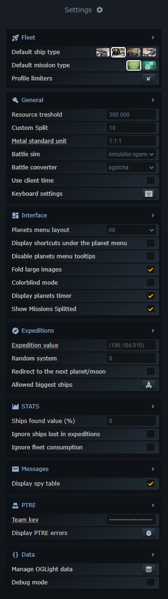
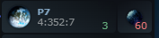
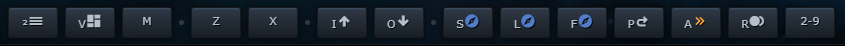
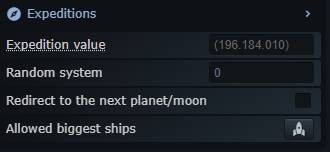
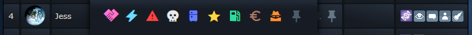

<table style="border: 0px">
<tr style="border: 0px">
<td style="width: 40%; border: 0px"></td>
<td style="width: 100%; border: 0px">
</td>
</tr>
</table>

# OGLight
Version: 5.8

Last Update: 2025/03/14 10:20:00

[Install](https://github.com/igoptx/ogameTools/raw/main/OGLight/OGLight.user.js)

---

# Features

## Settings

## Fleet

### Default Ship
This functionality will set one of those 4 ships as a default ship for the flights.

The available ships to be set as 'Default Ship' are:
* Small Cargo
* Large Cargo
* Recycler
* Pathfinder
* Spy Prob (If ship has cargo space)
 
Shortcut 'Z' to go to the previous ship 
Shortcut 'X' to go to the next ship

### Default Mission Type
This functionality allow you to set a default mission type to send resoucers to some planet/moon

### Profile Limiters
This functionality allow you to set a limit to the amount of ships that you want to keep to a planet/moon

## General

### Resource threshold
This is the minimum amount of resources that will be highlighted in the galaxy view

### Custom Split
This functionality allow you to set a custom split of ships/resources to be selected in the fleet page

Shortcut 'D' in the fleet page 1 to split ships and in fleet page 2 to split resources

### Metal Standard Unit
This is the relation between the resources

### Battle Sim
The simulator that will be used when you try to simulate a battle from a spy report

### Battle Converter
The default converter that will be used when you try to convert a CR from a message

### Use Client Time
Switch if tou want to use your local time or the server time

## Interface

### Planets Layout
This functionality allow you to set the layout of the planets in the side planet list

All 

Coords 

Resources 

Shortcut 'V' to switch between the layouts

### Display shortcuts under the planets menu
This checkbox will show the shortcuts under the planets menu or in the bottom of the page

Bottom 

Right 

### Fold large images
Prevent to show the large images

### Colorblind mode
Change the colors to help the colorblind people

### Display planets timer
Show (or not) the last activity time near the planet (in planets list)

### Show Missions Splitted
This checkbox allow to merge or split the missions in the planets list on the right

Splitted 

Merged 

## Expeditions

### Expedition value
This is the value that you will use to calculate the max profit of the expeditions

### Random System
The value to add or subtract to the system value of the expedition

### Redurect to the next planet/moon
This checkbox will redirect to the next planet/moon after the expedition is sent

### Allowed biggest ships

Here you can choose which ships you want to use in the expeditions (besides the normal expedition ships)

## STATS

### Ships found value
The percentage of the value to count to the daily profit

### Ignore ships lost in expedition
This checkbox will ignore the ships lost in the expeditions and therefor doesnt count to the daily loss

### Ignore fleet consumption
This checkbox will ignore the fleet consumption in the daily profit

## Messages

### Display spy table
This checkbox will show the spy table in the messages page

## PTRE

### Team Key
The key that you need to insert to have access to the PTRE info

### Display PTRE errors
Popup to see some errors related with PTRE integration

## Data

### Manage OGLight data
Here you can manage the data that OGLight stores in your browser 

# Collect Resources

With this functionality you can choose a planet/moon and OGLight will iterate from your planets/moons and send the default ship in the default mission type all the resources to the target planet/moon

# Account Summary

In this popup all info about the planets will be shown.

In red the lowest mine levels, in green the highest mine levels
At the side of the mine levels will be shown the next level if there is any building in progress

# Upgrades in Progress

In this popup you can see all the upgrades in progress in your planets/moons, the level that is being upgraded, the time left to finish the upgrade, the points that the upgrade will give you and the change in classification list

# Tagged Planets

In this list will appear the planets that you tagged in the galaxy view

How to tag planets in galaxy view

# Pinned Planets

In this list will appear the players that you pinned or click in the galaxy view

How to pin players in galaxy view

# Buy Me a Coffee

This is a link to my Buy Me a Coffee page where you can donate some money to help me to keep improving the script

# Sync Empire

This functionality will sync your OGLight account info with the OGame API
(This functionality run in the background from time to time, click to force the sync)