<table style="border: 0px">
<tr style="border: 0px">
<td style="width: 40%; border: 0px"></td>
<td style="width: 100%; border: 0px">
</td>
</tr>
</table>

# OGLight
Version: 5.1.0

Last Update: 2024/04/01 14:20:00

[Install](https://github.com/igoptx/ogameTools/raw/main/OGLight/OGLight.user.js)

---

## Features

### Settings
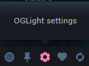

### Default Ship
This functionality will set one of those 4 ships as a default ship for the flights.

The available ships to be set as 'Default Ship' are:
* Small Cargo
* Large Cargo
* Pathfinder
* Spy Prob

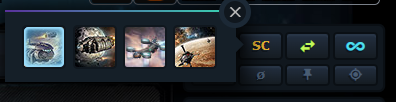

### Default Mission Type
This functionality allow you to set a default mission type to send resoucers to some planet/moon

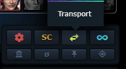
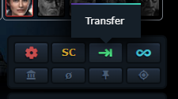

### Send All Resources 
This functionality allow you to send all resources from your planets to one of your choice.

To use this you just need to select one of your planets which you want to send from and click on the 'Send all resources to...' button.

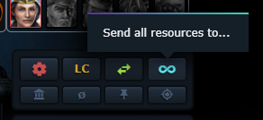

After that you click on the planet/moon that you want to receive all the resources

The fleet page will show up with the amount of 'Default Ship' to send the resources, and you just click 'Continue'

The 'Default Mission Type' will be selected and also the coordinates of the destination

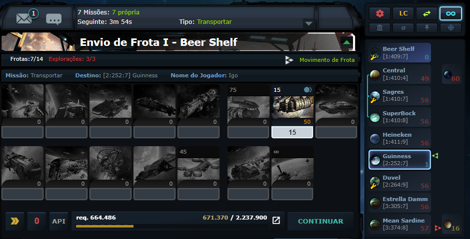

### Economy View
With this toggle you can see the coordinates of the planets or the amount of resources that you have in each planet/moon

You can also see the amount of resources in:

* your planets

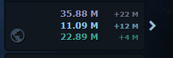

* Flying

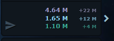

* Locked

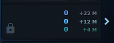

* In Total

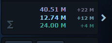

### Production View
With this functionality you can view a resume of your empire regarding the mines

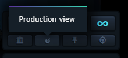

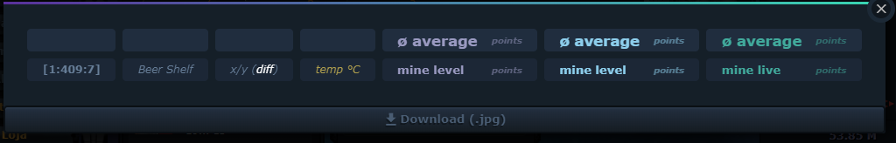

To retrieve the correct values in this view you need to go to:
* the details of the productions in every planet

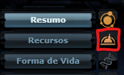

* the Life Forms bonus in every planet
  
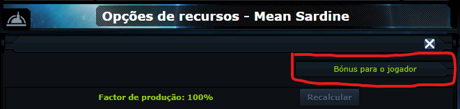

### Targets
If you click on 'Pinned Targets'

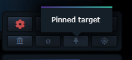

A side list will appear with the latests history of searched targets

To add new players to this list just go to 'Galaxy View' and click on the name of the player 

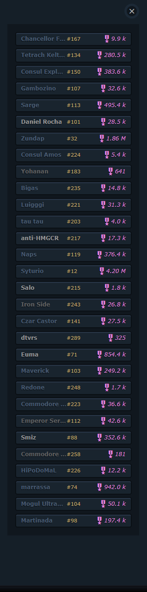

The Details of each player are:
* Total Points
* Economy Points
* Research Points
* Fleet Points
* Defense Points

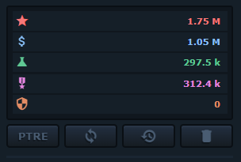

You have some buttons to:
* Show info present in PTRE (only works if you have a key inserted in Settings)
* Sync data with OGame API and PTRE info
* Return to the List of Targets
* Delete this player from the list

---
You can also go to 'Targets List' where you can store and search for the most important Targets 

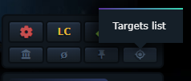

In this view you can find your most important targets by Galaxy and System

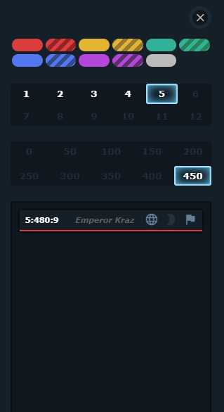

To add new Targets to this section you can go to 'Galaxy view' search for your target, put the mouse hover the player's name and select one of the colors

In that view you can:
* Write a message to the player
* Send a friend request
* Add the player to Ignore List
* Open the profile in MMORPG-STAT website
* Pin the player

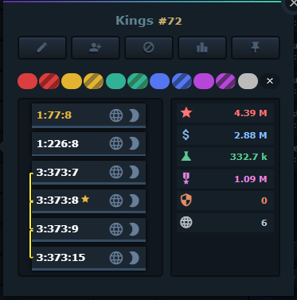

### STATS

In this little window you can see the profit that you made in the last X days

You have the button to signal that you have encounter in expeditions 

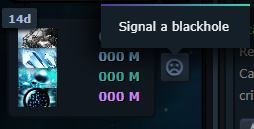

If you click on this button you will access the full detail profit stats 

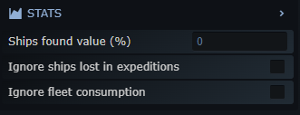

In this window you can select the time frame that you want to see your profit

You have access to Expeditions stats, Raids stats and Production

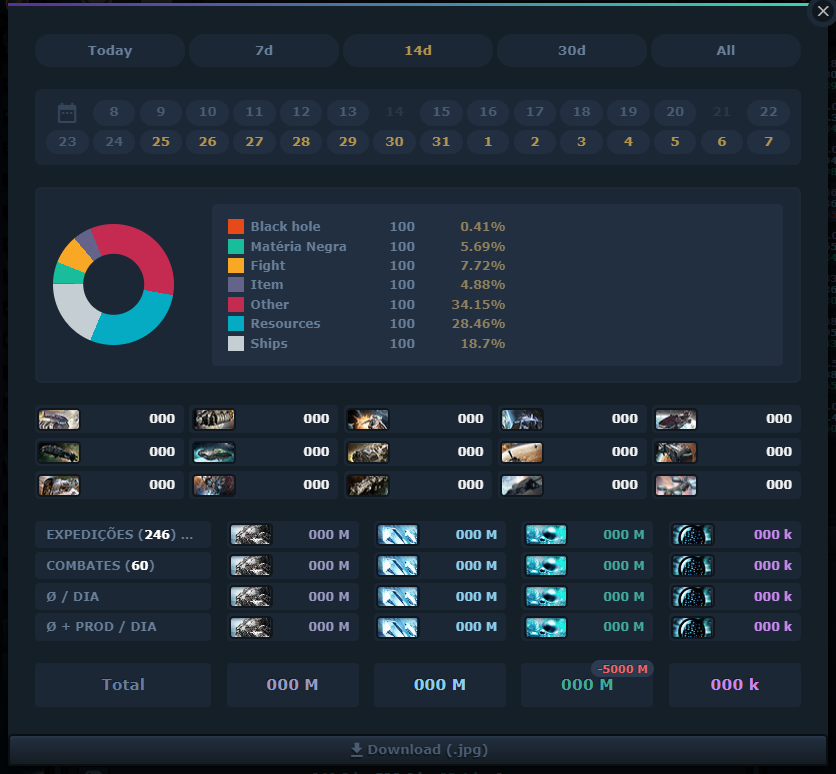 

### Spy Reports

Improved Spy Report List

Showing the Rentability, Fleet and Defense Points, Custom actions

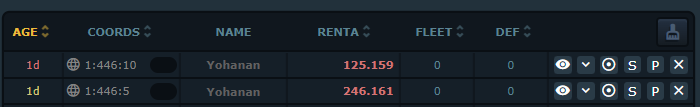

You can see the details of the possible loot

The actions that you can do from this view are:
* Spy
* Atack
* Simulate in TrashSim
* Import report to PTRE
* Delete

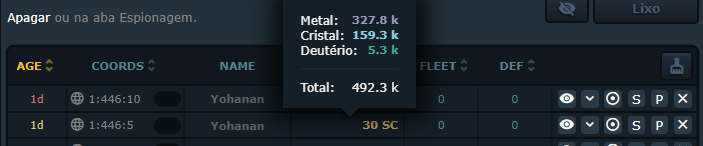

When you are spied that info (activity) to PTRE

### Raids

You can ignore the raids to not count in stats profit window

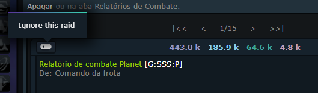

You can convert the CR directly from the messages page with the OGotcha Converter

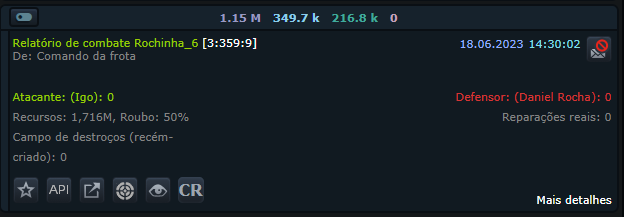

### Expeditions

You just need to pass by the reports to 'import' the data from the reports to the stats functionality

### Resources

You can 'lock' some resources to some building, research or an amount of ships/defeses that you want to build by clicking in the lock button

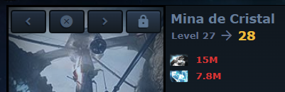

Then close to the planet/moon where you lock the resources will appear a lock icon

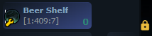

And if you click on that you will see all the resources lock to something in that planet/moon

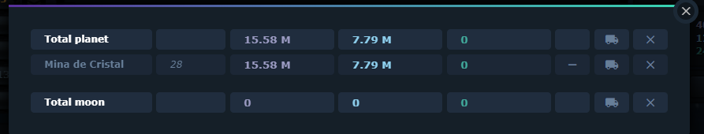

If you click on the truck icon the script will automatically go to fleet page, select the amount needed of default ships (if exists) with a default mission type and send this to the planet where you lock the resources

### Shortcut Keys

#### Fleet Page
* I -> Go to previous planet
* O -> Go to next planet
* R -> Reverse all selected ships or resources
* S -> Small Cargo Expedition
* L -> Large Cargo Expedition
* F -> Pathfinder Expedition
* A -> Select all ships or resources
* 2-9 -> Split by X ships or resources
* P -> Repeat previous fleet
* T -> Attack next target
* K -> Use the default ship and mission to go between planet and moon

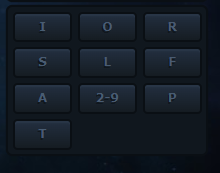

#### Galaxy View
* I -> Go to previous planet
* O -> Go to next planet
* S -> Previous galaxy
* Z|W -> Next galaxy
* Q|A -> Previous system
* D -> Next System

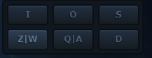

#### All other views
* I -> Go to previous planet
* O -> Go to next planet

#### Auctioneer
* 1 - Bid Metal (minimum needed)
* 2 - Bid Crystal (minimum needed)
* 3 - Bid Deuterium (minimum needed)