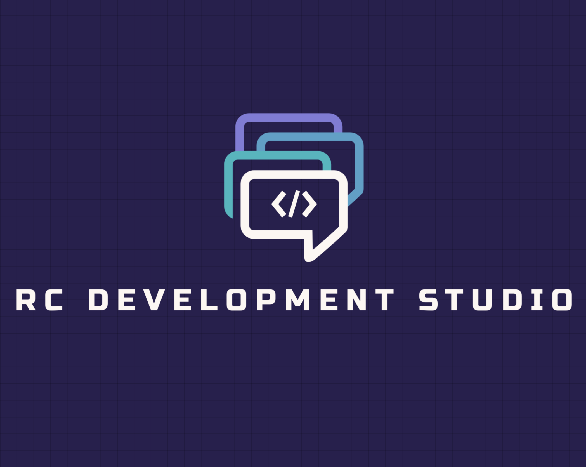

<table style="border: 0px">
<tr style="border: 0px">
<td style="width: 40%; border: 0px"></td>
<td style="width: 100%; border: 0px">
</td>
</tr>
</table>

## [OGLight](https://github.com/igoptx/ogameTools/tree/main/OGLight)

Version: 5.3.1

Last Update: 2024/04/30 14:50:00

[Install](https://github.com/igoptx/ogameTools/blob/main/OGLight/OGLight.user.js)

## InfoCompte

Version: 9.2.4.1

Last Update: 2023/06/05 15:21:00

[Install](https://github.com/igoptx/ogameTools/raw/main/InfoCompte/InfoCompte.user.js)

## InfoCompte Beta

Version: 9.2.5.5

Last Update: 2023/06/05 15:19:00

[Install](https://github.com/igoptx/ogameTools/raw/main/InfoCompte/InfoCompte_beta.user.js)
